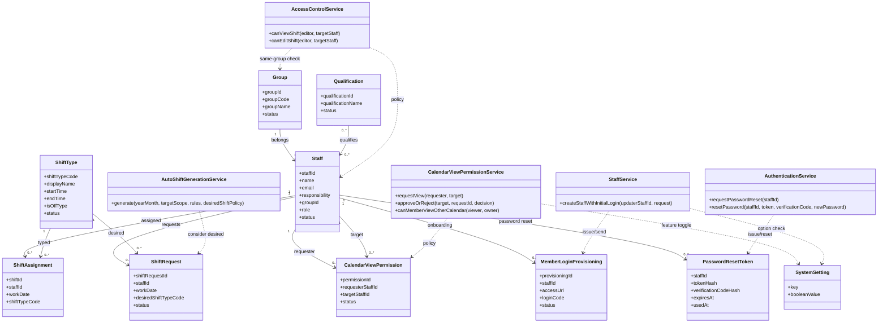

# ドメインモデル

## 位置づけ

- 分類: 設計資料（画面以外）
- 関連: `api_db_model.md`、`api_reference.md`

## 目的

勤務シフト作成・閲覧サービスの業務ルールを、実装に依存しない形で定義する。

## 境界づけられたコンテキスト

- シフト管理コンテキスト
: スタッフの月次シフト作成・更新・参照
- スタッフ管理コンテキスト
: スタッフ基本情報、権限、グループ、資格の管理
- マスタ管理コンテキスト
: シフト種類、資格マスタの管理
- 閲覧許可コンテキスト
: メンバー間カレンダー閲覧の申請・許可・失効管理
- 認証通知コンテキスト
: メンバー初回ログイン情報の発行・メール通知管理

## コア概念

- スタッフ
: シフト対象となる人員
- グループ
: メンバ/チーフの所属単位。チーフの操作可能範囲を決める
- シフト
: スタッフの特定日付における勤務割当
- 希望シフト
: スタッフが提出する希望勤務（確定シフトとは別管理）
- シフト種類
: 記号、名称、時間帯を持つ勤務種別
- 権限レベル
: メンバ / チーフ / マスタ
- カレンダー閲覧許可
: メンバー同士で相手のカレンダー閲覧を許可する関係
- システム設定
: メンバー間カレンダー閲覧機能の有効/無効などの運用設定
- 初回ログイン設定
: メンバー登録時にアクセスURL・ログインコード・初期パスワードを通知する処理

## 集約とエンティティ

### Staff 集約

- 集約ルート: Staff
- 主な属性
  - staffId（登録番号、自動割り付け、一意）
  - name（氏名）
  - email（メールアドレス）
  - phone（電話番号、オプション）
  - responsibility（担当）
  - groupId（所属グループ）
  - role（権限レベル）
  - qualificationIds（資格、0..*）
  - status（有効/無効）
- 不変条件
  - staffId は自動割り付け、一意
  - メンバは email 必須
  - role が メンバ または チーフ の場合、groupId は必須
  - status が 無効 でも履歴シフトは保持する
  - phone は未入力可

### Group 集約

- 集約ルート: Group
- 主な属性
  - groupId
  - groupCode（一意）
  - groupName
  - status（有効/無効）
- 不変条件
  - groupCode は一意
  - 無効グループは新規スタッフ割当不可

### ShiftAssignment 集約

- 集約ルート: ShiftAssignment
- 主な属性
  - shiftId
  - staffId
  - workDate
  - shiftTypeCode
  - note（任意）
  - updatedBy
  - updatedAt
- 不変条件
  - staffId + workDate は一意（1日1スタッフ1シフト）
  - shiftTypeCode は有効な ShiftType を参照

### ShiftRequest 集約

- 集約ルート: ShiftRequest
- 主な属性
  - shiftRequestId
  - staffId
  - workDate
  - desiredShiftTypeCode
  - status（DRAFT / SUBMITTED / APPLIED / REJECTED）
  - submittedAt（任意）
  - decidedAt（任意）
- 不変条件
  - staffId + workDate は一意（1日1希望）
  - desiredShiftTypeCode は有効な ShiftType を参照
  - 提出期限超過後は MEMBER による編集不可

### ShiftType 集約

- 集約ルート: ShiftType
- 主な属性
  - shiftTypeCode（記号、一意）
  - displayName（名称）
  - startTime（任意）
  - endTime（任意）
  - isOffType（休み種別フラグ）
  - status（有効/無効）
- 不変条件
  - isOffType = false の場合、startTime と endTime は必須
  - startTime < endTime

### Qualification 集約

- 集約ルート: Qualification
- 主な属性
  - qualificationId
  - qualificationName
  - description（任意）
  - status（有効/無効）
- 不変条件
  - qualificationName は運用上重複不可

### CalendarViewPermission 集約

- 集約ルート: CalendarViewPermission
- 主な属性
  - permissionId
  - requesterStaffId（閲覧申請者）
  - targetStaffId（閲覧対象者）
  - status（PENDING / APPROVED / REJECTED / CANCELED / EXPIRED）
  - requestedAt
  - respondedAt（任意）
  - expiredAt（任意）
- 不変条件
  - requesterStaffId != targetStaffId
  - requester/target は同一グループかつ MEMBER 同士のみ
  - 同一 requester-target で有効な APPROVED は1件まで

### SystemSetting 集約

- 集約ルート: SystemSetting
- 主な属性
  - key
  - booleanValue
  - updatedBy
  - updatedAt
- 不変条件
  - `calendarViewPermissionEnabled` は単一キーで管理
  - `memberLoginNotificationEnabled` は単一キーで管理

### MemberLoginProvisioning 集約

- 集約ルート: MemberLoginProvisioning
- 主な属性
  - provisioningId
  - staffId
  - accessUrl
  - loginCode
  - initialPasswordHash
  - status（ISSUED / SENT / FAILED / EXPIRED）
  - issuedAt
  - expiresAt
  - sentAt（任意）
- 不変条件
  - staff.role = MEMBER の場合のみ発行可能
  - 初期パスワードは平文保管しない（送信直後に破棄しハッシュのみ保持）

### PasswordResetToken 集約

- 集約ルート: PasswordResetToken
- 主な属性: staffId、tokenHash、verificationCodeHash、expiresAt、usedAt
- 不変条件
  - URLトークンと確認コードはハッシュのみ保存する
  - 発行から1時間で失効し、使用後は再利用できない
  - 新しい発行時に、同一スタッフの未使用トークンを無効化する

## 値オブジェクト

- RoleLevel
  - MEMBER
  - CHIEF
  - MASTER
- ShiftRequestStatus
  - DRAFT
  - SUBMITTED
  - APPLIED
  - REJECTED
- CalendarViewPermissionStatus
  - PENDING
  - APPROVED
  - REJECTED
  - CANCELED
  - EXPIRED
- MemberLoginProvisioningStatus
  - ISSUED
  - SENT
  - FAILED
  - EXPIRED
- YearMonth
- WorkDate
- TimeRange（startTime, endTime）

## ドメインサービス

- AccessControlService
  - canViewShift(editor, targetStaff)
  - canEditShift(editor, targetStaff)
  - ルール
    - MEMBER: シフト編集画面アクセス不可。個別カレンダー参照のみ
    - CHIEF: targetStaff.role = MEMBER かつ editor.groupId = targetStaff.groupId の場合のみ可
    - MASTER: 全スタッフ可

- ShiftAssignmentPolicy
  - assign(staffId, workDate, shiftTypeCode)
  - 日付重複や無効シフト種類の検証を行う

- AutoShiftGenerationService
  - generate(yearMonth, targetScope, generationRules, desiredShiftPolicy)
  - ルール
    - 希望シフト考慮モード（必須考慮 / 優先考慮 / 考慮しない）を適用
    - 充足要件と希望が競合する場合は未反映希望として記録

- CalendarViewPermissionService
  - requestView(requester, target)
  - approveOrReject(target, requestId, decision)
  - canMemberViewOtherCalendar(viewer, owner)
  - ルール
    - システム設定 `calendarViewPermissionEnabled` が有効時のみ申請/許可を受け付ける
    - APPROVED 状態かつ失効前の場合のみ閲覧可

- StaffService
  - createStaffWithInitialLogin(updaterStaffId, request)
  - ルール
    - MEMBER登録時に初回ログイン情報を発行する
    - システム設定 `memberLoginNotificationEnabled` が有効でSMTP送信可能な場合のみ自動送信する
    - 送信内容はアクセスURL、ログインコード、初期パスワードを含む
    - メール送信不可時は初回ログイン情報を画面表示用レスポンスに含める

- AuthenticationService
  - requestPasswordReset(staffId)
  - resetPassword(staffId, token, verificationCode, newPassword)
  - パスワード変更後、変更日時以前のJWTを無効化する

## リポジトリインターフェース

- StaffRepository
- GroupRepository
- ShiftAssignmentRepository
- ShiftRequestRepository
- ShiftTypeRepository
- QualificationRepository
- CalendarViewPermissionRepository
- SystemSettingRepository
- MemberLoginProvisioningRepository
- PasswordResetTokenRepository

## 主要ユースケースと集約利用

- スタッフ登録・編集（管理者）
  - Staff, Group, Qualification, StaffService
- 初回ログイン情報送信（オプション）
  - MemberLoginProvisioning, SystemSetting, StaffService
- パスワード変更
  - PasswordResetToken, AuthenticationService
- シフト編集（月次表）
  - ShiftAssignment, Staff, ShiftType, AccessControlService
- 自動シフト生成（月次）
  - ShiftAssignment, ShiftRequest, ShiftType, AutoShiftGenerationService
- スタッフ個別カレンダー表示
  - ShiftAssignment, Staff, ShiftType, AccessControlService
- 希望シフト提出
  - ShiftRequest, ShiftType
- メンバー間カレンダー閲覧申請/許可
  - CalendarViewPermission, SystemSetting, CalendarViewPermissionService
- 資格管理
  - Qualification
- シフト種類管理
  - ShiftType

## 権限制約（現要件反映）

- メンバはスタッフ個別カレンダー画面のみアクセス可能
- チーフは管理者画面アクセス不可
- チーフは同一グループのメンバに対してのみシフト確認・編集可能
- マスタは管理画面を含む全機能にアクセス可能
- メンバー同士の相互閲覧は、管理者設定で機能有効時のみ利用可能
- 機能有効時でも、申請先の許可がある場合に限り相手カレンダーを閲覧可能
- メンバー登録時に初回ログイン情報を発行し、通知設定有効かつSMTP送信可能な場合だけメール送信する
- SMTP送信不可時は初回ログイン情報を登録画面へ返す
- パスワード変更後は、変更日時以前のJWTを無効化する

## 概念図

## 実装時の推奨ポイント

- 認可はUI制御だけでなくAPI側でも強制する
- groupId の未設定・無効参照は保存時に拒否する
- 将来の監査対応として、ShiftAssignment の変更履歴を別エンティティで保持する
